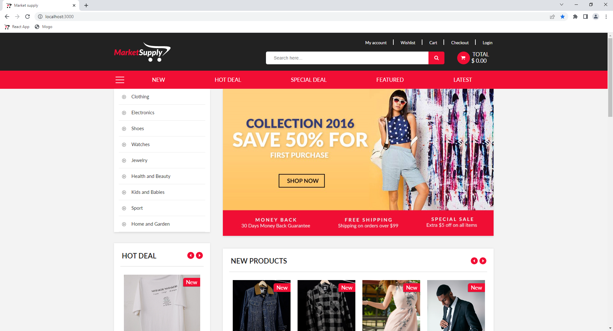
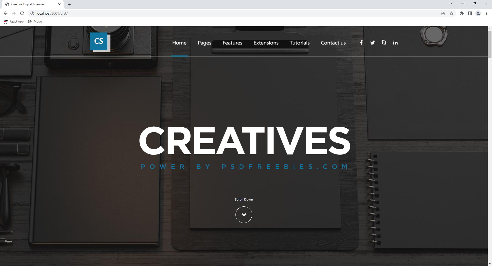
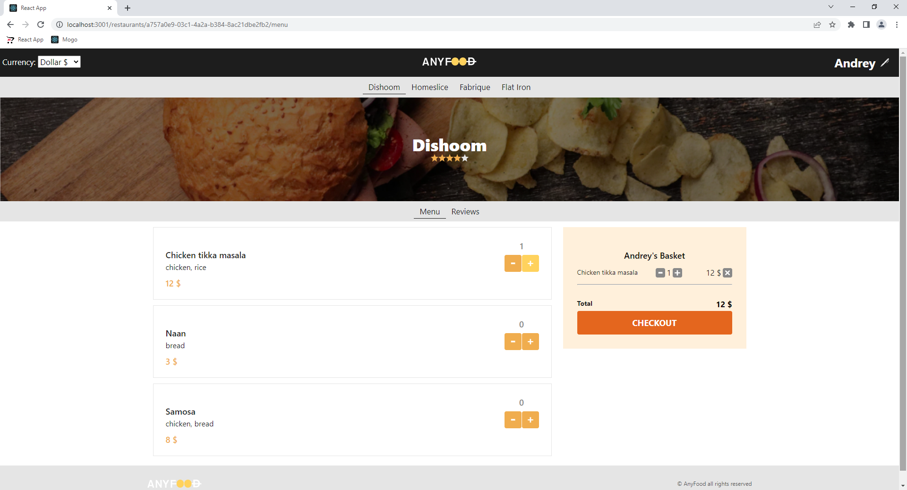

# Portfolio EN :uk:

## MarketSupply
__Description:__ Multipurpose online market

__Deployed project:__ http://market-supply.alexander-portfolio-and-cv.com

__Source code:__ https://github.com/alexReactDev/market-supply

__Used technologies:__

- Typescript
- React
- Redux toolkit
- Redux thunk
- React router
- Formik
- SCSS
- CSS modules
- React slick
- Axios
- Node.js
- Express
- JWT
- Bcrypt
- PostgreSQL

 

__About project:__ MarketSupply is a multipurpose online market where you can buy everything, from clothes to last Iphone model. You can use search and add products you like to wishlist. Authorized users have access to personal account where all earlier orders will be displayed, and forms auto-fill feature (data will be taken from profile). Application written using PERN technology stack, client routing and redux state manager. Interface made via adaptive-responsive layout, SCSS preprocessor and BEM methodology.

 

## Creative digital agency

__Description:__ Corporative landing

__Deployed project:__ http://creative.alexander-portfolio-and-cv.com

__Source code:__ https://github.com/alexReactDev/creative-digital-agency

__Used technologies:__

- SCSS
- BEM
- Kit (Turf)

 

__About project:__ Creative digital agency is a corporative website of art studio. It perfectly describes company advantages and provides contact form. Website made via adaptive-responsive layout, so it looks great on all devises despite screen size. Preprocessors SCSS, HTML kit and BEM methodology also were used in development.

 

## Flaby

__Description:__ Adaptive landing

__Deployed project:__ http://flaby.alexander-portfolio-and-cv.com

__Source code:__ https://github.com/alexReactDev/anyfood

__Used technologies:__

- SCSS
- BEM
- Adaptive-responsive design

__About project:__ Flaby is light adaptive landing, that describes products advantages and provides form for subscription. Thanks to adaptive-responsive design website looks great on all screens and devices. SASS preprocessor and BEM methodology also were used in development.

 

## AnyFood
__Description:__ Web-application for food ordering

__Deployed project:__ http://anyfood.alexander-portfolio-and-cv.com

__Source code:__ https://github.com/alexReactDev/anyfood

__Used technologies:__

- React
- Redux
- Redux thunk
- Immer
- Connected React Router
- Jest
- Enzyme
- Proptypes
- Reselect

 

__About project:__ AnyFood is application for online food ordering. You can order food from several restaurants and select currency that is convenient for you. Reviews and user rating can help you with choice. Application made via React/Redux stack. It also uses client Routing that make switching between pages almost immediate. Jest, Enzyme and Proptypes testing libraries also were used in development, that ensures high reliability and fault-tolerance.

Notice: It's an internship project completed as a part of React course from [learn.javascript.ru](learn.javascript.ru) website.

